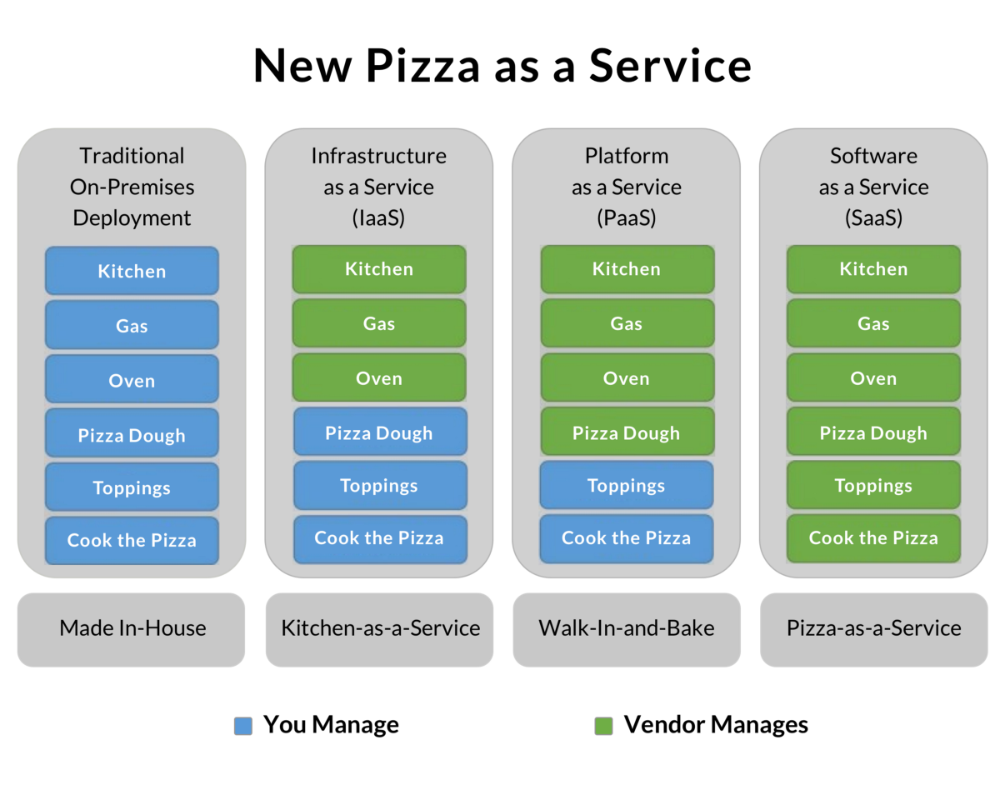
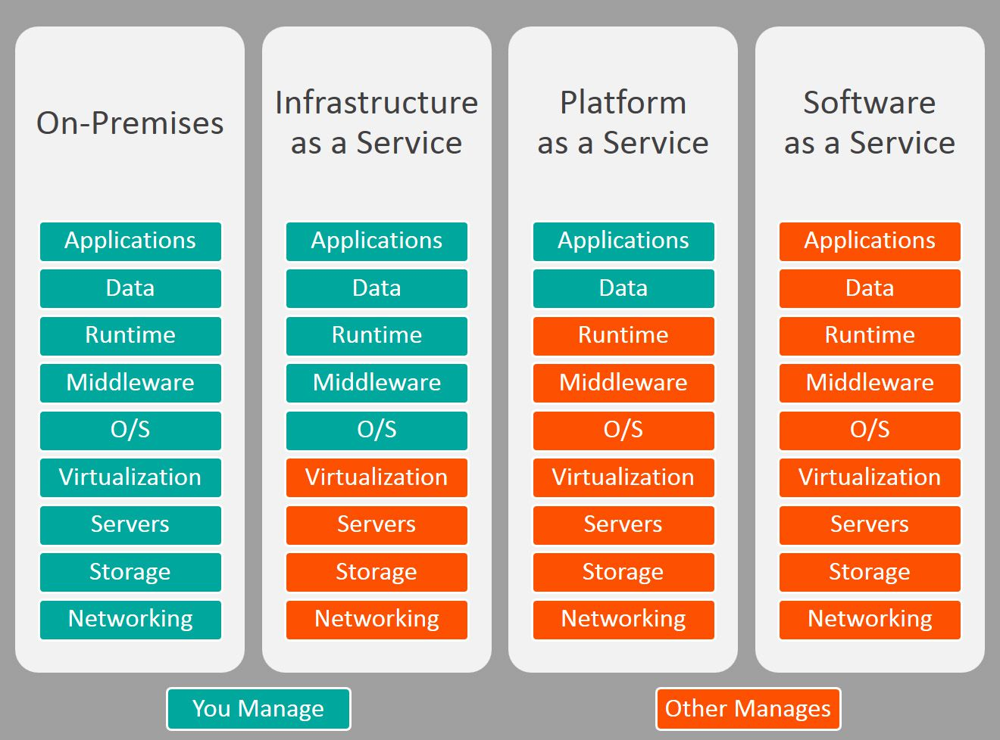

# Lecture Notes: Cloud Security Principles and Frameworks

## ISO and Cloud Frameworks

- **Why** (5 min)
  - Why do we care about cloud security frameworks?
    - Computing paradigms shift as we move into cloud systems
      - Who secures what part of the cloud? We'll look at the "shared responsibility model" today which attempts to define this.
      - Many traditional IT processes are abstracted away

      > David's story: "I previously worked with an ITAR-compliant company that needed to keep its data out of the hands of foreign nationals. We ended up adopting AWS GovCloud."

    - Cloud introduces new tooling we can use that is often superior to (or at least, more abstracted) traditional on-prem
    - Businesses are undergoing a digital transformation and rethinking how services are delivered, thus leading to aggressive cloud adoption as a business strategy.

  - Why do organizations adopt cloud services?
    - Rapid and simple deployment
    - Less time to market for services
    - Cost efficiency
    - More utilization of server resources
    - Less capital and operational costs
    - Better perceived security by managing and controlling it internally

- **What** (10 min)
  - Review fundamental cloud concepts and check for comprehension:
    - **IaaS**
      - A way of delivering computing infrastructure as on-demand services
      - A cloud computing model in which hardware, storage, and networking components are virtualized and provided by an out-sourced service provider
      - Allows dynamic scaling and the resources are distributed as a service
      - Generally includes multiple-user on a single piece of hardware
      - **Advantages**
        - The resources can be deployed by the provider to a customer's environment at any given time
        - Offers the users to scale the business based on their requirements
        - Provider has a lot of options when deploying resources including virtual machines, applications, storage, and networks
        - Is able to handle a huge number of users
        - Easy to expand and saves a lot of money, if handled correctly
    - **PaaS**
      - Cloud delivery model for applications composed of services managed by a third party
      - Provides elastic scaling of an application, allowing developers to build applications and services over the internet
      - **Advantages**
        - Programmers don't need to worry about what specific database or language the application is programmed in
        - Offers developers the ability to build applications without the overhead of the underlying OS or infrastructure
        - Gives developers the freedom to focus on the application's design while the platform takes care of the language and the database
    - **SaaS**
      - Allows users to run existing online applications and it is a model software that is deployed as a hosting service and are usually accessed over a browser
      - **Advantages**
        - A cloud computing service category providing a wide range of hosted capabilities and services
        - Provides a lower cost of ownership than on-premises software
        - Does not require the purchase or installation of hardware or licenses
        - Can be easily accessed through a browser along a thin client

    
    

    - **Cloud types**
      - **Private**
        - Hosted infrastructure on a private platform
        - Gives organizations more control over the infrastructure and is often restricted to organizational employees and business partners
        - Best choice if you need strict control of business-critical data and/or highly regulated businesses
        - **Advantages**
          - Better control over organizational data
          - Higher levels of security and customization
          - Better performance
          - Easier access to compliance data
        - **Disadvantages**
          - Building capacity limitations
          - Higher cost for infrastructure, maintenance and administration

      - **Public**
        - Environment in which the services and infrastructure are hosted at a service provider's offsite facility and can be accessed over the Internet
        - Many organizations share the main infrastructure, but their data is logically separated from that of other organizations
        - Best choice when an organization
          - Needs Scalability
          - Wants Reduced costs
          - Lacks in-house administrative personnel
          - Has a high maintenance, distributed network
        - **Advantages**
          - Lower infrastructure, maintenance, and administrative costs
          - Greater hardware efficiency
          - Reduced implementation time and availability of short-term usage
        - **Disadvantages**
          - Greater vulnerability
          - Diminished control of organizational data and the environment
          - Reduced bandwidth

      - **Hybrid**
        - A combination of public and private customer-managed infrastructure on premises
        - Allows an organization to leverage the advantages of both environment types
        - Best choice when an organization offers services that need to be configured for diverse vertical markets or has varying needs
        - Ideal for organizations migrating to public clouds

  - What is a CSP?
    - A **cloud service provider (CSP)** is "a company that offers some component of cloud computing; typically when you search the internet a cloud service is defined as, infrastructure as a service (IaaS), software as a service (SaaS) or platform as a service (PaaS) to other businesses or individuals. We know the usual suspects; Microsoft Azure, AWS and Google Cloud, but it is not always that simple." -[CSA](https://cloudsecurityalliance.org/blog/2020/04/30/what-is-a-cloud-service-provider/)
  - What CSP will we be using in Ops 401?
    - AWS

      

  - What does **abstracted** mean?
    - A process that you'd normally have to configure and oversee in a LAN gets "abstracted away" on the cloud.

    

  - What is the **Shared Responsibility Model**?
    - Reference [AWS documentation](https://aws.amazon.com/compliance/shared-responsibility-model/). Also, there's an old [slide deck](https://www.slideshare.net/AlertLogic/the-aws-shared-responsibility-model-presented-by-amazon-web-services) on this topic.
    - Security and Compliance is a shared responsibility between AWS and the customer, although:
      - Customers are responsible for their security and compliance IN the cloud
      - AWS is responsible for the security OF the cloud

      

    - Standard services
    - Container services
    - Abstracted services
  - What are the ISO and cloud frameworks?
    - **ISO 27001** is a comprehensive set of standards for information security, including best practices for security and risk management, compliance, and technical implementation.
      - More technically specific than ISO 31000 regarding information security practices
    - **ISO 31000** (or 31K) is a comprehensive set of standards for enterprise risk management.
      - Not focused solely on information security risks
      - Usable for any type of risks including business continuity, market, currency, credit, operational, etc.
      - Less technically specific than ISO 27001
      - Provides an excellent framework for Enterprise Risk Management (ERM)
    - **Cloud Security Alliance (CSA)** is an industry body providing security guidance to cloud service providers (CSPs), including enterprise reference architecture and security controls matrix.
      - CSA developed their own cybersecurity framework called the [Cloud Controls Matrix (CCM)](https://cloudsecurityalliance.org/research/cloud-controls-matrix/)
      - CSA also developed the [Security Guidance v4.0](https://cloudsecurityalliance.org/research/guidance/)
        - "The goal of the fourth version of Security Guidance for Critical Areas of Focus in Cloud Computing is to provide both guidance and inspiration to support business goals while managing and mitigating the risks associated with the adoption of cloud computing technology."
    - The **Statements on Standards for Attestation Engagements (SSAE)** are audit specifications developed by the American Institute of Certified Public Accountants (AICPA)
      - The **Service Organization Control (SOC2)** framework evaluates the internal controls implemented by the service provider to ensure compliance with Trust Services Criteria (TSC) when storing and processing customer data.

      

      - SOC3
        - Main difference is that SOC 2 is a restricted use report while SOC 3 is a general use report
  - What is the **Artifact Portal** on AWS?
    - Central resource for compliance-related information that matters to you. It provides on-demand access to AWS’ security and compliance reports and select online agreements.

- **How** (30 min)
  - How do I ensure my CSP is secure?
    - Access the CCM spreadsheet and discuss some example objectives from it.
    - "It would be prudent to require that your CSP submit a self-assessment against the CCM’s extended question set, the Consensus Assessment Initiative Questionnaire (CAIQ) or what is better known as CSA Security Trust Assurance and Risk (STAR) STAR Level 1 and is the first of three levels of transparency and Assurance provided by the STAR Program.
    - The CAIQ offers an industry-accepted way to document what security controls exist in cloud services, providing security control transparency and to some extent assurance. It provides a set of Yes/No questions a cloud consumer and cloud auditor may wish to ask of a cloud provider to ascertain their compliance to the Cloud Controls Matrix (CCM). Therefore, it helps cloud customers to gauge the security posture of prospective cloud service providers and determine if their cloud services are suitably secure."
  - Ref. [DEMO.md](DEMO.md)
